# Terraform Infrastructure Repository

## Overview

This project demonstrates an event-driven, highly scalable, highly available, fault tolerant infrastructure with fully automated CI/CD pipelines and monitoring. 

The application consists of a frontend connected to an API that submits tasks to an Amazon SQS queue, while a separate microservice, deployed on Amazon ECS, processes these tasks. Currently, the tasks are designed solely to consume CPU resources for 2–5 seconds, simulating a workflow without performing any meaningful operations.

Here is a quick glance off the app flow from the `AWS X-RAY Service Map`:

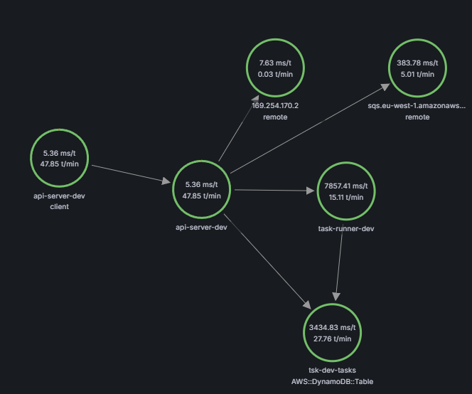

*It's key characteristics are*:

- **Event driven**: Tasks are pushed to an AWS SQS Queue and consumers execute them
- **Highly scalable**: Scaling up to more workers increases the amount of tasks being completed every minute
- **Highly available**: It's spread across multi availability zones
- **Fault tolerant**: Each task which is not successfully completed gets retried

This repository contains the configuration and scripts for managing the infrastructure and configuration using Terraform. It includes the setup for all AWS resources, deployment processes, monitoring configurations, and related automation.

## Organisation Strcture 

```bash
/org
├──/devops (this repo)   # Entrypoint
├──/api                  # Simple NodeJS express API server
├──/task-runner          # Microservice that runs the app's tasks
└──/frontend             # Frontend app
```

Each repository has it's own Workflow CI file which triggers the deployment workflow in this repo. The deployment process is handled by this repo.

## Architecture

### AWS Infrastructure

   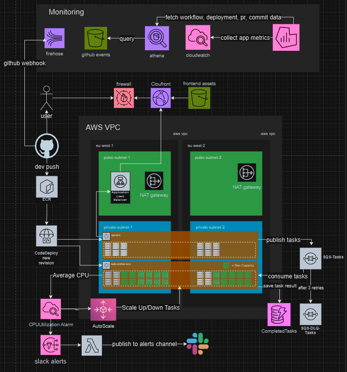

### CI/CD Pipeline

 - When we want to deploy a new app
      1. We store the needed variables for running the deploy workflow (ecs service ids, arns, s3 buckets) in github environments using terraform `terraform/github.tf` module.

         An example `api-dev` environment in Github:

         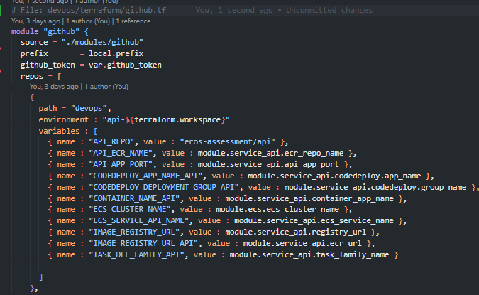

         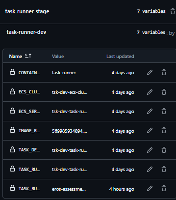

   - Continuous Integration (CI) pipelines are managed in the application code repositories (api, task-runner, frontend), encompassing processes such as build, test, static analysis, and artifact export. For commits pushed to the `dev`, `stage`, or `production` branches, an additional step, `trigger-deployment`, is executed in their workflows. This step initiates the deployment workflow located in the `devops` repository, using the specified GitHub environment as the context.

      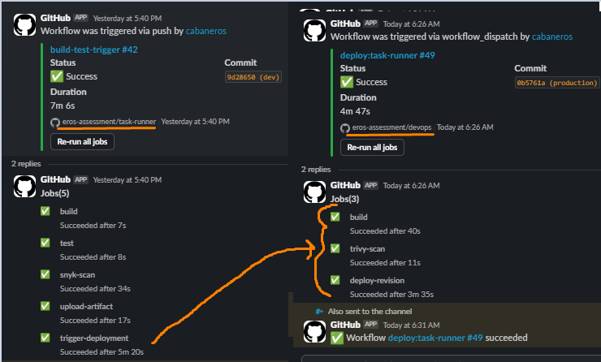

 - Continuous Delivery (CD) pipelines can be different for each application in the stack.. 
      1. **API**:
         - Build Docker image.
         - Push image to Amazon Elastic Container Registry (ECR).
         - Perform a Blue/Green deployment behind a load balancer.
      2. **Task Runner**:
         - Build Docker image.
         - Push image to Amazon Elastic Container Registry (ECR).
         - Execute a rolling deployment with rollback and circuit-breaker capabilities.
      3. **Frontend**:
         - Upload static assets to an S3 bucket.
         - Invalidate the CDN cache to ensure changes are served promptly.

         In this diagram, we see how each application is deployed in each environment.

         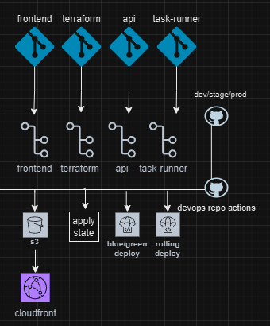

### Application Flow

## Prerequisites

Before you start, ensure you have the following installed and configured:

1. **AWS User Credentials**  
   - You need AWS access and secret keys with admin access to manage infrastructure.
   - Configure your credentials using the AWS CLI:

     ```bash
     aws configure
     ```

   - Alternatively, set the following environment variables:

     ```bash
     export AWS_ACCESS_KEY_ID=your-access-key-id
     export AWS_SECRET_ACCESS_KEY=your-secret-access-key
     ```

2. **Installed Tools**
   - **Terraform**: Download and install from [Terraform's official website](https://www.terraform.io/downloads.html).
   - **AWS CLI**: Download and install from [AWS CLI's official website](https://aws.amazon.com/cli/).

3. **Backend Initialization Script**  
   - The script `setup-terraform-backend.sh` sets up the Terraform backend for remote state management, including the creation of an S3 bucket and a DynamoDB table.

## Initial Setup

Follow these steps to initialize the Terraform backend:

1. Clone the repository:

   ```bash
   git clone https://github.com/eros-assessment/devops.git
   cd eros-assessment/devops
   chmod +x setup-terraform-backend.sh
   ./setup-terraform-backend.sh

## Repository Secrets Setup

To ensure secure and automated operations, you need to configure the following repository secrets in your GitHub repository. These secrets are required for CI/CD pipelines and infrastructure management.

### Required Secrets

Set the required secrets, variables to the organization and DevOps repo

1. **SNYK_TOKEN**  (secret)
   - A token for [Snyk](https://snyk.io/) to enable vulnerability scanning and reporting.
   - Obtain the token from your Snyk account and add it to the repository secrets.

2. **ORG_TOKEN**  (secret)
   - A GitHub fine-grained personal access token with administrative rights on the repository.
   - You can create this token via the GitHub Developer Settings:
     - Go to **Settings > Developer settings > Personal access tokens > Fine-grained tokens**.
     - Grant the token access to the repository with the necessary scopes.

3. **AWS_ACCESS_KEY_ID** and **AWS_SECRET_ACCESS_KEY**  (secret)
   - Credentials for an AWS user with sufficient permissions to manage resources.
   - Configure an AWS IAM user with programmatic access and the required permissions.
   **AWS_DEFAULT_REGION**  (variable)
   - Default AWS Region.
   **SLACK_WEBHOOK_URL**  (variable)
   - Used for slack notifications.

### Setting Secrets/Variables in GitHub

1. Navigate to your repository on GitHub.
2. Go to **Settings > Secrets and variables > Actions > New repository secret/variable**.
3. Add each of the following secrets:
   - `SNYK_TOKEN` (org secret)
   - `ORG_TOKEN` (org secret)
   - `SLACK_WEBHOOK_URL`(org secret)
   - `AWS_ACCESS_KEY_ID` (devops secret)
   - `AWS_SECRET_ACCESS_KEY`(devops secret)
   - `AWS_DEFAULT_REGION`(devops variable)

## Deploy the app

- You can setup as many environments as you want simply by creating a new terraform `workspace` . Each environment has it's own VPC, tagging and terraform state

   ```terraform
   terraform init
   terraform workspace create dev
   # create {workspace}.tfvars file at ./variables
   terraform apply -var-file=./variables/dev.tfvars
   ```

- After creating the resources you can go to your AWS console at Load Balancer section and visit `/` to fetch the frontend and forward send some to the workers.

   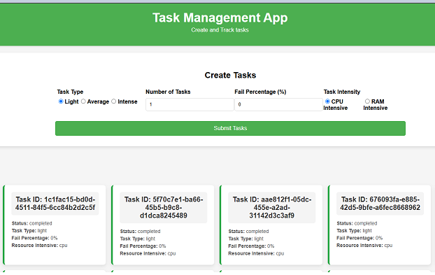

- Next, you may access the AWS Grafana dashboard that was created on your AWS console to get insights about the app status and DevOps metrics.

   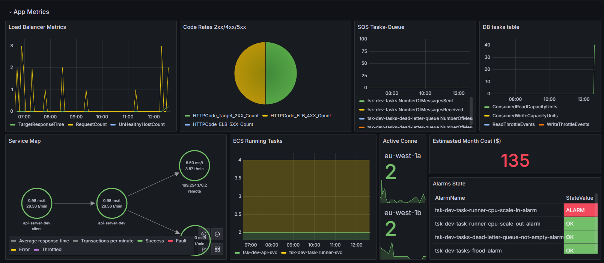
   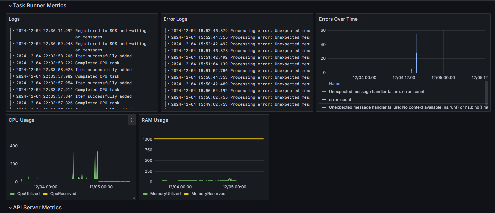
   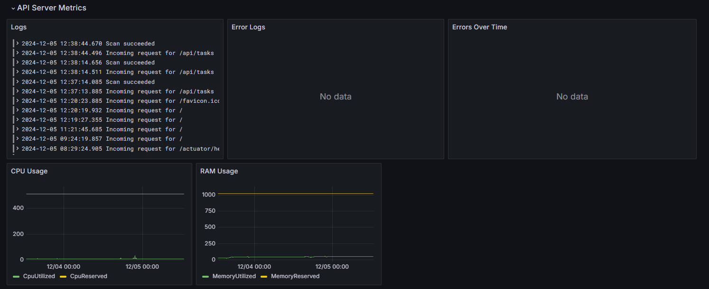
   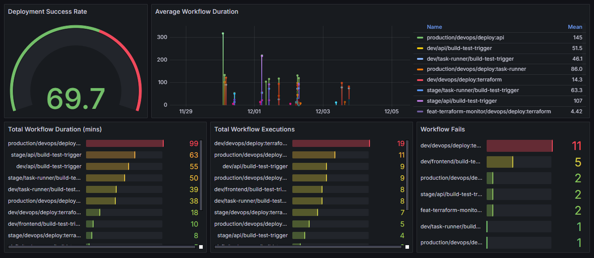

- After finishing up you can tear down the infrastructure by running

   ```terraform
   terraform destroy -var-file=./variables/dev.tfvars
   ```

## Current Costs and Future Optimization

- We can see on this diagram our application will cost around $1.5 per day (with 1 environment).

   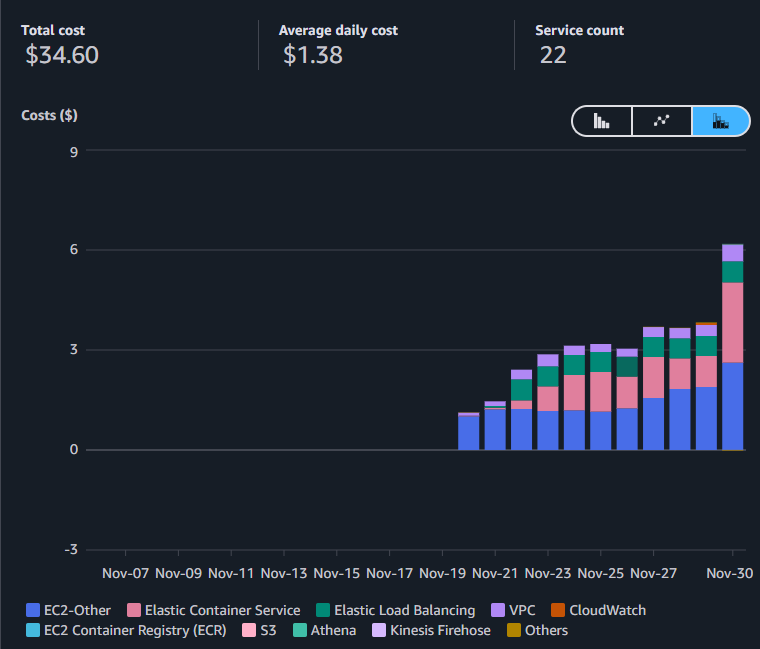

### Cost analysis

It's visible from the costs explorer that the most expensive service is the `EC2 Compute` and the `ECS`. The future cost really depends on the expected traffic and load.

*Some key considerations are*:

1. Do I expect to have constant traffic throughout the day?
   - If yes, then sticking to the current solution will be optimal because we will have low `idle` time running our `ECS instances`.
2. Do I expect to have low traffic with not many spikes?
   - If yes, then switching to a serverless solution like `AWS Lambda` can be a cheaper alternative. It will significantly reduce the `idle` time and can be scaled up to a decent amount. A downside of Lambda functions are `cold-starts` during spikes which can affect user performance.
3. Do I expect to have normal traffic but big sudden spikes?
   - If yes, a hybrid solution can be implemented. `EC2 spot instances` can be used for the daily normal traffic and scale up when needed by adding more `EC2 instances`, `ECS Fargate` tasks or `AWS Lambda` depending on the workload.

Other actions that could help reduce costs:

   1. Use another long term solution for log storage/analysis instead of `CloudWatch`, since it can be expensive and slow under huge load. `Grafana Loki` could be a solution which is a high scalable log aggregation system designed to work seamlessly with `Grafana`,

## Test Live Environment

The `dev` environment is live. You can navigate to the website to add tasks and visit the `grafana dashboard` to monitor the application

1. Website: https://dev.deveros.click
2. Grafana:
   - URL: https://g-36d19ba829.grafana-workspace.eu-west-1.amazonaws.com
   - Username: dashboard-viewer
   - Password: 654765476547654!Ayfdg